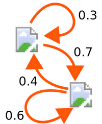

# Markov Images

  

---

> Pix2Pix but not Pix2Pix

This project is about a porbabilistic graph also named markov chain. In a nutshell, what this program does is to generate a new image from a source image using a markov chain in between them. 

The question it asks every time in order to generate a new pixel is: If my current pixel is A which pixel B is more probable to come after.

## Requirements
```
python 3.7
virtualenv
```

## Run locally
```bash
virtualenv -p python3 .env
source .env/bin/activate
pip install -r requirements.txt
python main.py $JPG_FILE
```

## LICENSE
This project is under the MIT license